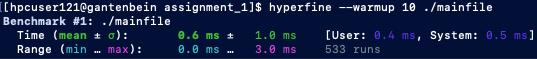
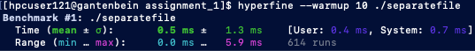
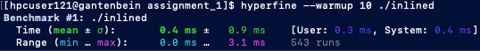

[//]: # (To preview markdown file in Emacs type C-c C-c p)

# Assignment 1: Optimization
The goal of the first assignment is to practice how to time and profile code,
and to inspect some aspects that contribute to performance.

## Time
Parametric study of **optimization flags**:

- `-O0`: the average elapsed time of 10 loops is 2.195925845 sec (min).
- `-O1`: the average elapsed time of 10 loops is 2.198843204 sec.
- `-O2`: the average elapsed time of 10 loops is 2.199601650 sec (max).
- `-O3`: the average elapsed time of 10 loops is 2.196532865 sec.
- `-Os`: the average elapsed time of 10 loops is 2.196100256 sec.
- `-Og`: the average elapsed time of 10 loops is 2.199355819 sec.

Example of compilation to assembly code for `-O0`:
`gcc time_sum.c -S -O0 -o time_sum_O0.s`

## Inlining

Benchmarking of `mainfile` program:

Benchmarking of `separatefile` program:

Benchmarking of `inlined` program:

### `nm` tool

When examining the first two executables for symbols that correspond to
`mul_cpx_mainfile` and `mul_cpx_separatefile`, they can be found in
both cases:

`0000000000401120 T mul_cpx_mainfile`

`00000000004011a0 T mul_cpx_separatefile`
