[//]: # (To preview markdown file in Emacs type C-c C-c p)

# Assignment 1: Optimization
The goal of the first assignment is to practice how to time and profile code,
and to inspect some aspects that contribute to performance.

## Time
Parametric study of **optimization flags**:

- `-O0`: the average elapsed time of 10 loops is 2.195925845 sec (max).
- `-O1`: the average elapsed time of 10 loops is 0.283882913 sec.
- `-O2`: the average elapsed time of 1000 loops is 0.000000048 sec.
- `-O3`: the average elapsed time of 1000 loops is 0.000000046 sec (min).
- `-Os`: the average elapsed time of 1000 loops is 0.000000047 sec.
- `-Og`: the average elapsed time of 10 loops is 0.563465545 sec.

Example of compilation to assembly code for `-O0`:
`gcc time_sum.c -S -O0 -o time_sum_O0.s`

Examination of assembly code suggests that high optimization levels (larger
than 1) surpress the execution of the loop and print the result directly (value
is already present in assembly code).

## Inlining
Benchmarking of three programs when repeating multiplications 100,000 times
gives the following elapsed timings:

- `mainfile`: 0.000186 msec.

- `inlined`: 0.000180 msec.

- `separatefile`: 15834.270968 msec.

The `separatefile` program is **much slower** possibly because the compiler
misses the information about the program, needed to optimize the
code (e.g. automatic inlining).

To remedy this, one might try to enable **link-time optimizer**.
For GCC this can be enabled with `-flto` flag<sup>[1](#myfootnote1)</sup>:
> When invoked with source code, it generates GIMPLE (one of GCC’s internal representations) 
> and writes it to special ELF sections in the object file. 
> When the object files are linked together, all the function bodies are read from these ELF
> sections and instantiated as if they had been part of the same translation unit.

> To use the link-time optimizer, -flto and optimization options should be
> **specified at compile time and during the final link**.
> It is recommended that you **compile all the files** participating in the same link with
> the same options and also **specify those options at link time**.

<a name="myfootnote1">1</a>: [Using the GNU Compiler Collection (GCC)](https://gcc.gnu.org/onlinedocs/gcc/Optimize-Options.html)

The new execution time for `separatefile` program is 0.000187 msec, i.e. the same as for
the **inlined** counterpart.

### `nm` tool
When examining the first two executables for symbols that correspond to
`mul_cpx_mainfile` and `mul_cpx_separatefile`, they can be found in
both cases:
```
0000000000401120 T mul_cpx_mainfile
00000000004011a0 T mul_cpx_separatefile
```


## Locality
The time of row and column summations compiled with `-O0, -march=native` flags was:

- Average (from 10,000) elapsed time of **row** summation: 2.407893455 msec.
- Average (from 10,000) elapsed time of **column** summation: 2.905988410 msec.


The original code compiled with 2nd level optimization (`-O2`) gave faster resuts:

- Average (from 10,000) elapsed time of **row** summation: 1.031412517 msec.
- Average (from 10,000) elapsed time of **column** summation: 1.420934522 msec.

If we take into account the memory access pattern, it is possible to
speed up the **column** summation procedure by respecting the fact that cache
line prefetches data in a row:
```
for ( size_t ix=0; ix < nrs; ++ix )
    sums[ix] = 0; // Initialize sum.
    
for ( size_t ix=0; ix < nrs; ++ix )
    for ( size_t jx=0; jx < ncs; ++jx )
        sums[jx] += matrix[ix][jx];
```
If we apply this procedure to both **row** and **column** summations (for the row
summation case additional initialization loop is superfluous because the initialization
can be done inside the outer loop) the timings become as follows:

- Average (from 10,000) elapsed time of **row** summation: 1.074372172 msec.
- Average (from 10,000) elapsed time of **column** summation: 0.560611644 msec.

At the first glance, this is a surprising result.
However, if one takes into account the part of the lecture on **hardware architecture**
that concerns **pipelining** and **data blocking**,
it is possible to realize that that in the case of the **row** summation writing into 
the same element of `sums` array is being done within the inner loop, and the
CPU cannot know that the instructions are _independent_:
```
for ( size_t ix=0; ix < nrs; ++ix ){
    sums[ix] = 0; // Initialize sum.

    for ( size_t jx=0; jx < ncs; ++jx )
        sums[jx] += matrix[ix][jx];
}
```
This **breaks the pipeling** and the instructions are carried out sequentually!

The pipelining can be fixed by explicitly telling the CPU that the instructions
are independent.
To this end, one can introduce **additional variables** and partially
**unroll the loop**:
```
for ( size_t ix=0; ix < nrs; ++ix ){
    double sum0 = 0, sum1 = 0, sum2 = 0, sum3 = 0;
    for ( size_t jx=0; jx < ncs; jx += 4 ){
        sum0 += matrix[ix][jx    ];
        sum1 += matrix[ix][jx + 1];
        sum2 += matrix[ix][jx + 2];
        sum3 += matrix[ix][jx + 3];
    }
    sums[ix] = sum0 + sum1 + sum2 + sum3;
}
```
As a result, the **row** summation procedure is faster again:

- Average (from 10,000) elapsed time of row summation: 0.321366179 msec.
- Average (from 10,000) elapsed time of column summation: 0.476664307 msec.

### To-do list
- [ ] Try to further improve the column summation by splitting it into blocks
      (see lecture).
- [ ] Try to see from the assembly code how the sequencing is done in the row and 
      column summation cases.


## Indirect addressing
Benchmarking with `-O0` flag:

- Procedure **1**: 35.713863 msec.
- Procedure **2**: 22.647007 msec.
- **Alternative** procedure: 15.258435 msec.

Benchmarking with `-O2` flag:

- Procedure **1**: 33.492691 msec.
- Procedure **2**: 13.831841 msec.
- **Alternative** procedure: 10.758333 msec.

Procedure **1** is considerably slower than the rest, probably due to cache misses
due to large jumps in indices.
Procedures **2** and the **alternative** one have very similar elapsed times
and the algorithms, except that the former makes use of the additional vector
to look up indices (that are already known within the loop).
Therefore, the additional memory access is probably responsible for partly breaking
the pipeline and increasing the runtime.


## Writing to HDD and SSD
- Writing and reading to **HDD**:
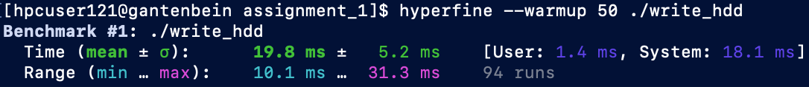
- Writing and reading to **SSD**:
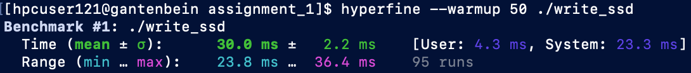

Writing to **HDD** is about 30\% faster, which is surprising since we are
dealing with **one file** only.
It turns out that when the information about the number of files to be copied is
available to **_RAID_** controller, it can parallelize the procedure.

- Copying `include` directory to **HDD**:
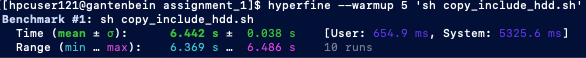
- Copying `include` directory to **SSD**:
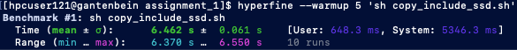

The runtimes are virtually the same, which is not that surprising
since in the lecture we were told that **HDD** in **_RAID_** can
have larger bandwidth.


## Valgrind
- `memcheck` of original program:
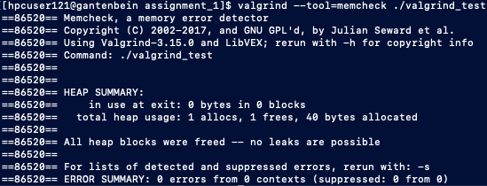
We see that no errors is reported and that we allocated and freed space for
10 integers (40 bytes) in memory.
Interestingly, if one adds a **print** statement, there is another memory allocation
taking place and the amount of memory allocated on the heap grows significantly:
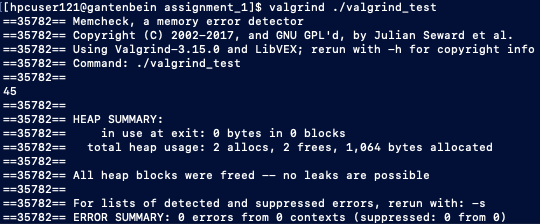

- No initialisation (with `--track-origins=yes`):
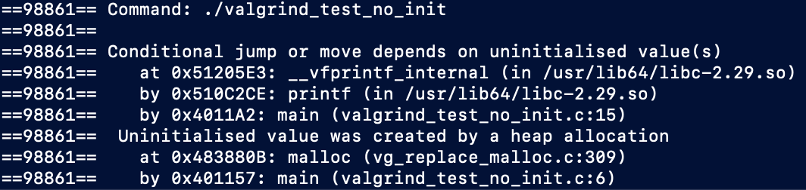

- No freeing of memory:
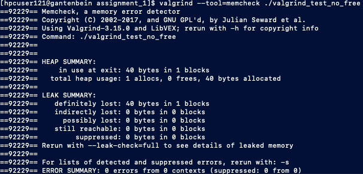

- Double freeing of memory:
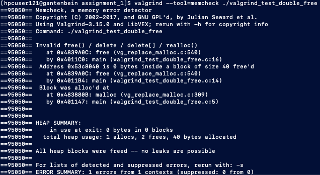

## GDB
- Running `gdb invalid_access` gives:
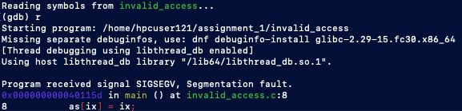
- Entering `focus src` followed by `p as` ouputs:
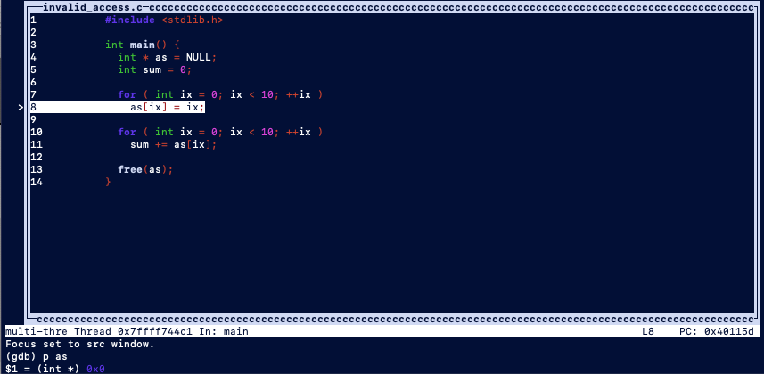

NOTE: if you need to pass arguments to your program you can invoke GDB with
`gdb --args PROGRAM ARGS`.


## Learing summary
From the course web page<sup>[2](#myfootnote2)</sup>:
> Like Assignment 0, this assignment is a preparation towards your working on Assignments 2 through 5. In particular, you will need the following to facilitate your course studies:
> - From the first part, it is helpful to remember that reasonable benchmarking of small pieces of code can be achieved by running it sufficiently often and taking the average. Recall from the lecture that running code a single time incurs so many random effects that the result cannot be considered a benchmark.
> - From the second part, it is useful to remember that inlining of code potentially speeds up a function. This is particularly true if the function is small. To explicitly suggest to the compiler that a function be inlined you can prepend the declaration with “static inline”.
> - From the third part, it is useful to remember that locality can make a dramatic difference in runtime. To see this effect, it is really crucial here to run the code sufficiently often (at least 100000 times) when benchmarking.
> - From the fourth part, it is useful to remember that indirect addressing always comes with extra cost. But that extra cost raises enormously when memory is accessed in a nonlinear way.
> -From the fifth part, it is useful for future use beyond this course to remember that the advantage of SSD might be overcompensated by RAID.
> - From the sixth and seventh part, it is useful to remember valgrind and GDB as efficient means to detect incorrect memory access. When you observe a segmentation fault in your program, one of the first steps to locate it should involve the use of valgrind and GDB.

<a name="myfootnote2">2</a>: [TMA881 2019: Assignment 1](https://www.raum-brothers.eu/martin/Chalmers_TMA881_1920/assignments.html#optimization)
